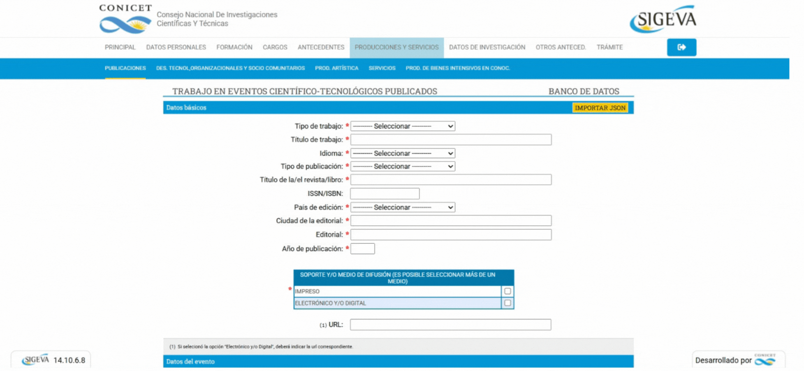

# SIGEVA-JSON

La extensión permite **importar** y **exportar** datos fácilmente en formato JSON para artículos de congresos, capítulos de libro y revistas.

La extensión fue probada solo en navegadores basados en Chromium, igual debería funcionar (mínimanente) en Firefox también.

## Instalación

    

1. Descargá el último [release](https://github.com/indirivacua/SIGEVA-JSON/releases) del paquete de la extensión y extraélo.

2. Accedé a `chrome://extensions`. Activá la opción **Modo de desarrollador** (esquina superior derecha).

3. Hacé click en **Cargar extensión sin empaquetar** y seleccioná la carpeta donde extrajiste la extensión.

## Uso

| Importar JSON | Exportar JSON |
|:---:|:---:|
|    Seleccioná el JSON para cargarlo en la extensión. |    Exportá los datos procesados en un archivo JSON. |
